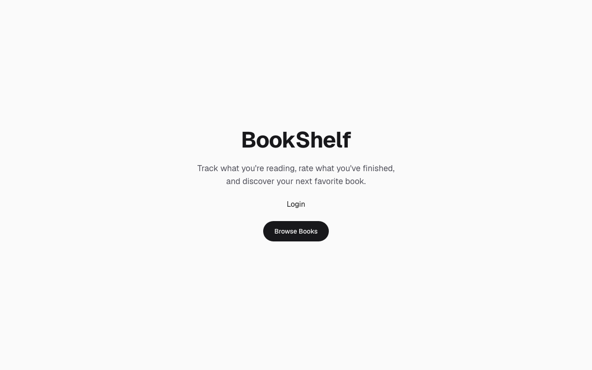
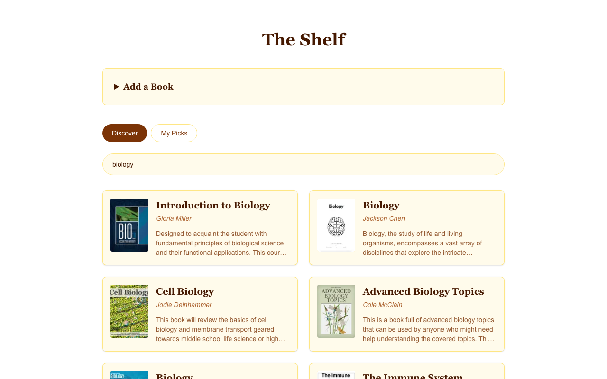
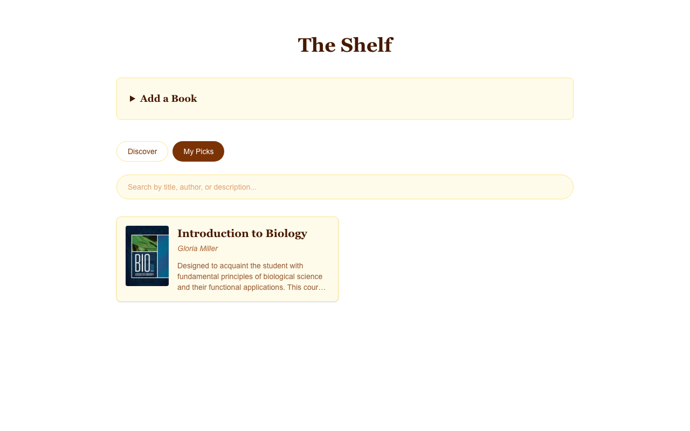
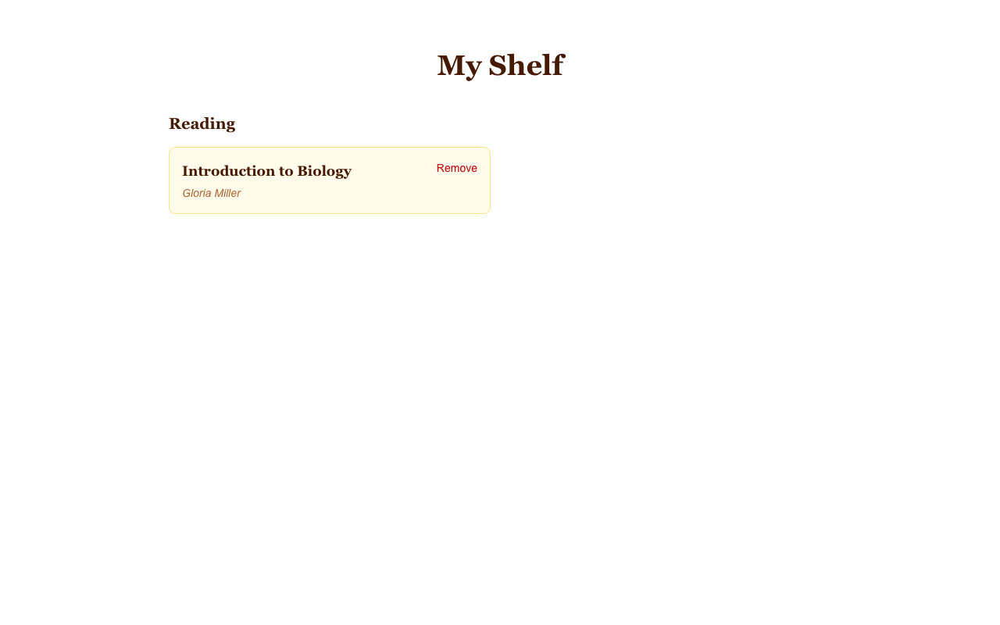

# BookShelf

A reading tracker built to learn the Next.js App Router hands-on — search real books, track what you're reading, and add your own. Live at **[book-shelf-taupe-delta.vercel.app](https://book-shelf-taupe-delta.vercel.app)**.



## Features

- **Search & browse books** via the iTunes Search API, with debounced, URL-driven search (shareable/bookmarkable search URLs, results fetched and cached server-side)
- **Book detail pages** with per-book SEO metadata, cover art via `next/image`, and a 404 page for invalid ids
- **Personal shelf** — mark a book Want to Read / Reading / Finished, with a dedicated My Shelf page grouped by status
- **Discover / My Picks tabs** — Discover searches the full catalog; My Picks searches only what's on your shelf
- **Add your own books**, via a real Server Action form — the same feature was also built as a plain no-JS form and a client-side `fetch` version, kept commented in the code for reference (see [`docs/LEARNINGS.md`](docs/LEARNINGS.md) Phase 5)
- **Auth-ready structure** — routes are split into `(public)`/`(dashboard)` groups, with a `proxy.ts` gate protecting `/shelf` behind a session check (currently a fake cookie — see [Known limitations](#known-limitations))
- **Virtualized book list** — only visible rows render as real DOM nodes, via `@tanstack/react-virtual`
- SEO basics: dynamic `<title>`s, `sitemap.xml`, `robots.txt`

| Discover | Book detail |
|---|---|
|  |  |

| My Picks | My Shelf |
|---|---|
|  |  |

## Tech stack

- [Next.js 16](https://nextjs.org/) (App Router, Turbopack) + React 19 + TypeScript
- [Tailwind CSS v4](https://tailwindcss.com/)
- [iTunes Search API](https://developer.apple.com/library/archive/documentation/AudioVideo/Conceptual/iTuneSearchAPI/) for book data
- [`@tanstack/react-virtual`](https://tanstack.com/virtual) for list virtualization
- [`he`](https://github.com/mathiasbynens/he) for decoding HTML entities in API responses
- Deployed on [Vercel](https://vercel.com/)

## Architecture & key decisions

- **Server Components by default.** Data fetching (search, book lookups) happens server-side; `"use client"` is only used where real interactivity is needed (the search input, the shelf's status buttons) — kept as small, deliberate "client islands" rather than converting whole pages.
- **Server-driven search.** Typing in the search box updates the URL's `?q=` (debounced), and the Server Component re-fetches — not client-side filtering. This makes searches shareable/bookmarkable and lets Next.js cache results server-side.
- **Explicitly temporary, backend-ready data stores.** The shelf lives in `localStorage`; custom books live in a JSON file on disk. Both are deliberate, documented stand-ins for a real database — chosen so the *shape* of the app (Route Handlers, Server Actions, the auth gate) is already correct and ready to swap in Postgres/Prisma + real auth later, without restructuring the app.
- **Route groups for auth-readiness.** `(public)` and `(dashboard)` organize routes without adding URL segments, so `/shelf` can be gated by `proxy.ts` today with a fake session cookie, and swapped for real auth later with no routing changes.

For the full, detailed log of what was learned, including real bugs hit and fixed along the way (a module-instance-isolation bug across Route Handlers, a React Strict Mode + `localStorage` race condition, why `next/image` requires an explicit host allowlist, and more), see [`docs/LEARNINGS.md`](docs/LEARNINGS.md) and the phase-by-phase plan in [`docs/NEXTJS_LEARNING_PLAN.md`](docs/NEXTJS_LEARNING_PLAN.md).

## Known limitations

- **Custom books don't reliably persist in production.** They're stored in a JSON file on disk, which works great in local dev but not on Vercel's serverless functions (an ephemeral, often read-only filesystem) — adding a custom book in the deployed app currently fails. This is intentional for now: the fix is a real database, planned for the next learning phase, not a workaround.
- **Auth is fake.** `/shelf` is gated by a real cookie check in `proxy.ts`, but the cookie is set by a `/api/fake-login` endpoint with no real credential verification — a structural placeholder for real auth (Auth.js), not a security boundary.
- **No automated tests yet.**
- **Accessibility and responsive-design passes are still pending** — deferred from Phase 7, not yet revisited.

## What's next

- Real backend: **Postgres + Prisma** for data, **Auth.js** for real authentication — replacing the `localStorage` shelf, the JSON-file custom books, and the fake session cookie all at once
- A **GraphQL** layer over the app's own data (once there's a real relational schema worth querying)
- An **AI-powered recommendation feature** — suggest books based on a user's shelf and ratings
- Accessibility + responsive design pass
- Automated tests

## Running locally

```bash
git clone git@github.com:SiddhantKaura/book-shelf.git
cd book-shelf
npm install
cp .env.example .env.local
npm run dev
```

Open [http://localhost:3000](http://localhost:3000).
